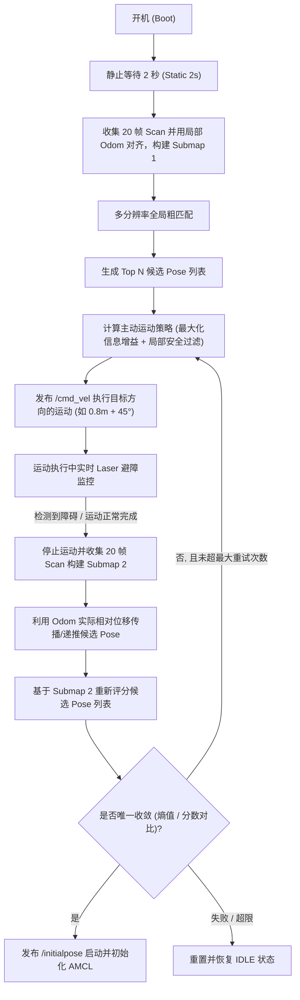

# 主动位姿校准与实时避障安全探索执行计划

该计划描述了在 AMCL 初始化对齐前，进行主动、自引导的定位校准节点设计与实现。它取代了原先固定的“前进 1 米”的简单逻辑，改为动态规划能最大化消除候选位姿歧义（信息增益最大）且局部安全的运动，在运动中利用原始 Lidar 扫描进行实时避障，并整合多帧扫描（20 帧）构建局部子图以消除单帧噪点与盲区。

## 用户确认事项 (User Review Required)

> [!IMPORTANT]
> **主动运动控制 (`/cmd_vel`)**：
> 节点在主动定位校准阶段将主动发布 `/cmd_vel` 速度指令。虽然系统会通过雷达 `/scan` 进行安全性检查，但仍请**确保物理机器狗处于开阔无遮挡区域**（有至少 $\sim 1.0\text{m}$ 的安全活动空间）再启动校准。
>
> **地图对齐前的纯里程计移动**：
> 在定位成功前，机器狗将完全依赖 `/odom`（里程计坐标系）进行局部闭环移动控制。由于移动距离短（约 $0.8\text{m}$），里程计的局部漂移极小，该方式是安全且可靠的。

## 开放问题 (Open Questions)

> [!NOTE]
> 暂无。设计完全覆盖了用户的全部功能要求。

---

## 拟引入的修改 (Proposed Changes)

我们将重写尚未跟踪的校准节点 [auto_initial_pose_calibrator.py](file:///D:/01-Code/dog_slam/LIO-SAM_MID360_ROS2_PKG/ros2/src/nav2_dog_slam/src/auto_initial_pose_calibrator.py) 并更新其配置文件 [auto_initial_pose_calibrator.yaml](file:///D:/01-Code/dog_slam/LIO-SAM_MID360_ROS2_PKG/ros2/src/nav2_dog_slam/config/auto_initial_pose_calibrator.yaml)。

### [nav2_dog_slam]

#### [MODIFY] [auto_initial_pose_calibrator.yaml](file:///D:/01-Code/dog_slam/LIO-SAM_MID360_ROS2_PKG/ros2/src/nav2_dog_slam/config/auto_initial_pose_calibrator.yaml)

在配置中新增或调整以下参数：

* **主动控制参数**：最大线速度、最大角速度、控制器比例增益 $K_p$ 与 $K_\omega$。
* **避障参数**：安全避障停机距离、碰撞检测扇区阈值。
* **主动探索参数**：可选局部候选方向（如 $0^\circ, \pm 45^\circ, \pm 90^\circ$ 等）、信息增益采样点参数。
* **子图参数**：单次子图累计帧数（默认 20 帧）、角度网格分辨率。

#### [MODIFY] [auto_initial_pose_calibrator.py](file:///D:/01-Code/dog_slam/LIO-SAM_MID360_ROS2_PKG/ros2/src/nav2_dog_slam/src/auto_initial_pose_calibrator.py)

重写该节点以支持新的状态机逻辑，具体工作流程如下：



### 核心功能模块设计

#### 1. 局部子图构建器 (`SubmapBuilder`)

通过局部里程计增量合并多帧连续激光扫描（如 20 帧）：

* 缓存子图采集起点位姿：$T_{start} = T_{odom}$。
* 依次获取各帧激光相对于起点的变换：$T_{rel} = T_{start}^{-1} \cdot T_{odom}$。
* 将所有激光点通过 $T_{rel}$ 投影至起点坐标系中。
* 采用角分辨率过滤（如将 $360^\circ$ 划分为 720 个 bin，保留每个 bin 内的最小测距值），合成为一帧高精度的“超级激光帧”供匹配算法评分使用。

#### 2. 主动运动选择器（局部安全 + 最大信息增益）

评估 $K$ 个备选移动向量 $\Delta \mathbf{u} = (\Delta s \cos \theta, \Delta s \sin \theta, \Delta \phi)$：

* **局部安全过滤**：
  检查当前 `/scan` 数据。若机器人在局部 $\theta \pm 22.5^\circ$ 扇区内的最小测距值小于目标移动距离加安全裕度 $\Delta s + d_{safe}$，则将该方向过滤，标记为**不安全**。
* **最大信息增益计算**：
  对于所有安全的可行方向，利用地图信息评估对 Top N 个候选 Pose 的判别能力：
  将每个候选位姿通过 $\Delta \mathbf{u}$ 递推至下一步预测位姿 $P_i'(\theta) = P_i \oplus \Delta \mathbf{u}$。
  以 $P_i'$ 为中心，在地图中以多个径向方向和距离采样周围的似然场数值，生成特征特征向量 $\mathbf{v}_i$。
  通过计算各特征向量之间的差异度（如方差或两两距离之和）来评估信息增益：
  $$IG(\theta) = \sum_{j > i} \|\mathbf{v}_i - \mathbf{v}_j\|_2^2$$
  选择使得 $IG(\theta)$ 最大的安全方向作为下一步运动指令。

#### 3. 实时避障比例控制器 (P-Controller)

* 利用当前 `/odom` 与起点里程计，在机器人坐标系下对目标运动点执行闭环比例控制，生成 $v_x, v_y, \omega$。
* 运行中持续订阅 `/scan`。如果运动前进方向（$\pm 45^\circ$ 锥角内）的激光测距小于阈值（例如 $0.4\text{m}$），立即发布零速指令紧急停止，宣告运动提前结束并触发下一步的子图收集。

---

## 优化与潜在注意点 (Optimizations & Considerations)

### 1. 性能与计算成本优化

* **信息增益计算限制**：为避免过多候选 Pose（Top N）和运动方向计算过慢，我们将限制 Top N 最大值为 10，且仅评估 8 个粗粒度方向（每 $45^\circ$ 一个）。利用 NumPy 进行矢量化操作，加速似然场的多点插值查询。
* **异步子图构建**：雷达回调和 Odom 回调在 ROS 的事件驱动线程中运行，采用双缓冲区模式累积 Scan。主状态机线程在运动结束后再触发 Submap 的一次性合并生成，避免阻塞主循环。

### 2. 运动控制与安全性设计

* **参数调试指导**：避障安全距离、控制增益等参数均暴露在 [auto_initial_pose_calibrator.yaml](file:///D:/01-Code/dog_slam/LIO-SAM_MID360_ROS2_PKG/ros2/src/nav2_dog_slam/config/auto_initial_pose_calibrator.yaml) 中，强烈建议优先在仿真环境调试通过。
* **Odom 漂移与滑移应对**：当四足机器人在未完全对齐的地面打滑时，里程计存在误差。除了短距离（$0.8\text{m}$）限速移动外，合并 20 帧点云时会对近邻帧执行简单的局部 Scan Matching 匹配或粗滤波（如体素滤波），以降低滑移带来的点云重影影响。
* **动态运动步长**：若 Top N 位姿分布极度分散（信息熵大），采用常规长步长（如 $0.8\text{m}$）；若候选已集中在少数几个近邻位姿，缩短步长（如 $0.4\text{m}$）仅作微调，以加速收敛。

### 3. 可视化与判定优化

* **收敛判定**：唯一收敛的熵值与分数比对阈值均参数化，提供防提前误判的容错保护。
* **RViz 可视化调试支持**：节点将新增发布 `geometry_msgs/msg/PoseArray`（用于在 RViz 中实时渲染 Top N 候选位姿）和 `/submap_scan` 话题，直观展示定位匹配的过程。
* **人工标记真值与 Odom 偏差校对工具**：
  * **工作流**：用户在 RViz 中使用 “2D Pose Estimate” 在地图上标记机器狗的实际物理起点（真值位姿 $P_{gt}$）。
  * **偏差计算**：节点接收到该真值后，记录此时的起点里程计 $P_{ref\_odom}$。当机器狗移动时，利用当前里程计实时递推计算并发布纯里程计推算的预计 map 坐标：$P_{est} = P_{gt} \oplus (P_{ref\_odom}^{-1} \oplus P_{curr\_odom})$，发布为 `/debug/odom_est_pose`。
  * **实时校对**：节点将实时输出纯里程计推算位姿 $P_{est}$ 与当前实际候选位姿（或 AMCL 定位值）之间的坐标偏差（$\Delta x, \Delta y, \Delta \theta$），使用户能直接量化校对里程计的精度和漂移率。

---

## 验证计划 (Verification Plan)

由于本节点运行依赖于完整的 ROS2 Humble 拓扑（雷达发布、仿真环境/狗本体运行、Odom 发布），验证需要由用户在 Ubuntu 环境下配合进行：

1. **编译运行节点**：

   ```bash
   ros2 launch nav2_dog_slam auto_initial_pose_calibration.launch.py
   ```

2. **触发校准流程**：

   ```bash
   ros2 service call /start_auto_calibration std_srvs/srv/Trigger
   ```

3. **监控日志输出**：

   ```bash
   ros2 run nav2_dog_slam auto_initial_pose_calibrator.py --ros-args --log-level DEBUG
   ```

4. **人工测试避障**：在机器人主动移动中，用纸板突然挡住激光雷达前方，验证 `/cmd_vel` 是否能立即中断为 0，并平稳过渡至下一阶段。
5. **观测结果**：验证节点是否在唯一收敛时发出正确的 `/initialpose` 激活定位。
